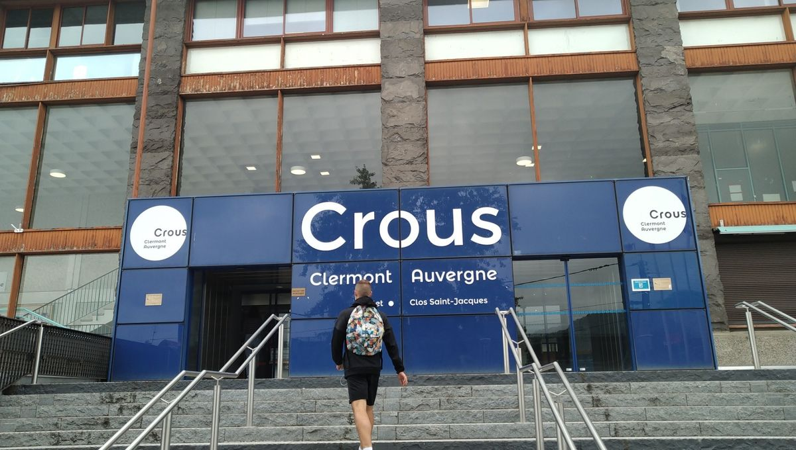

## CROUS

Le CROUS (Centre Régional des Œuvres Universitaires et Scolaires) est une structure essentielle pour les étudiants. Il offre une variété de services pour améliorer la vie quotidienne des étudiants, tels que :

- **Restauration** : Des restaurants universitaires et des cafétérias proposant des repas équilibrés à prix abordables.
- **Logement** : Des résidences universitaires et des aides à la recherche de logement.
- **Bourses** : Des informations et un accompagnement pour les demandes de bourses sur critères sociaux.
- **Activités culturelles** : Organisation d'événements culturels, de loisirs et de sports.

Le CROUS est un lieu de vie et d'échanges, idéal pour rencontrer d'autres étudiants et profiter de diverses activités. N’hésitez pas à vous renseigner sur les services disponibles près de chez vous !

Si vous vouler aller 